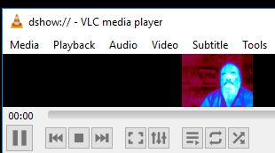
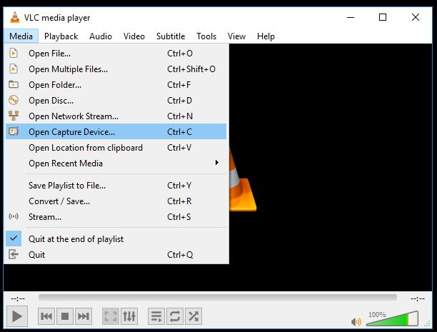
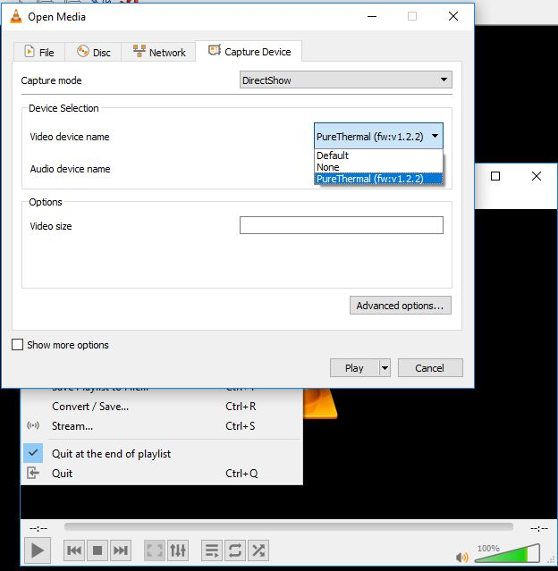
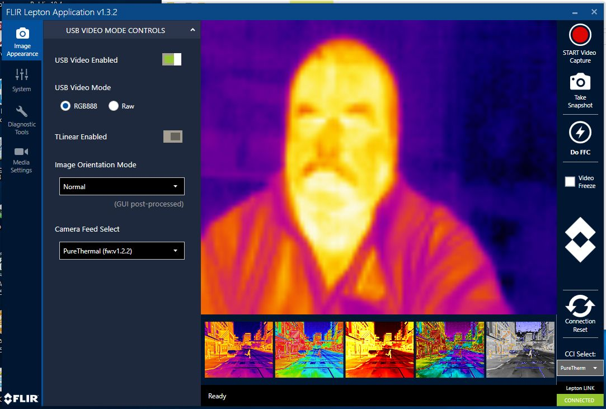
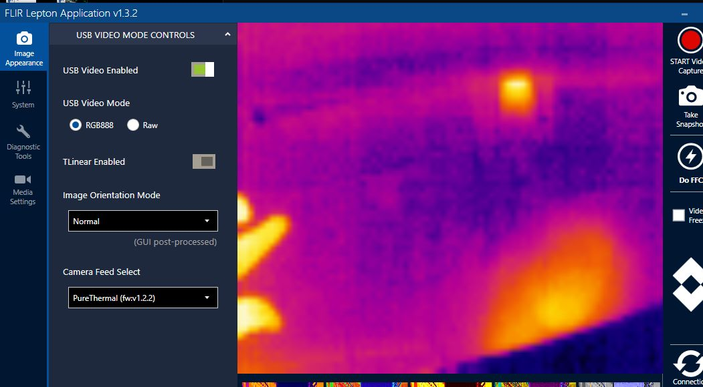

# PureThermal2 Testing

Screen capture of VLC Media Player during first use of PureThermal2

This was taken on a windows 10 computer.

## Connecting to the Device using VLC Media Player

I have no prior experience with VLC Media Player. The following shows how I connected to the device.
Note this gave a slow update of about one frame a second. Changing some setting will likely speed that up.

## Connecting to the Device using FLIR Lepton Application

It is more straight forward to connect to the image using the FLIR Lepton Application as it is specific to the device.

There is also a starter users guide to using this the pureThermal2 and the FLIR Lepton Application.

* [PureThermal-2-Basic-Lepton-Features.pdf](https://lepton.flir.com/wp-content/uploads/2015/06/PureThermal-2-Basic-Lepton-Features.pdf)

The first time I downloaded it they asked for contact information.

The install file can be found here:

* [LeptonUserApp](https://lepton.flir.com/wp-content/uploads/2015/06/LeptonUserApp_1.3.2.msi_.zip)

Those links and more were found here:

* [https://lepton.flir.com/software-sdk/](https://lepton.flir.com/software-sdk/)

### Image of hand - USB Flash Drive - Mouse

Example photo that includes my hand on the lower left, a usb flash drive on the upper right and a optical mouse on the lower right.

## Inserting Camera into Board
 
Used image at [https://groupgets.com/manufacturers/getlab/products/purethermal-2-flir-lepton-smart-i-o-module](https://groupgets.com/manufacturers/getlab/products/purethermal-2-flir-lepton-smart-i-o-module)
to get correct orientation of module in socket. 
 

 
### Anti-static Precautions

Used anti-static strap plugged into ground.

Also used sheet of black anti-static foam grounded at one corner as a mat.

### Concern about retaining Camera Module in Socket

The thermal Camera Module was carefully inserted in the socket and so far it does not appear to be ready to just fall out; however I have read concerns about 
that possibility. I decided to look for any recommendations on mounting the camera module and the camera board before proceeding to avoid any missteps 
(since the module is about $300 CAD).

found at [https://groupgets.com/manufacturers/getlab/products/purethermal-2-flir-lepton-smart-i-o-module]

~~~~
    b-cubed  Tom • 3 months ago
    Yes, I talked to FLIR. They pointed out page 68 of their FLIR LEPTON® Engineering Datasheet where it shows that 
	the Lepton is meant to be retained in the socket by a gasket / window / cover. The assumption is that the 
	Lepton will need to be protected from environmental hazards.

    While waiting to get through to FLIR I purchase another Lepton and PureThermal-2 (as well as some Molex sockets) 
	to see what I could learn about the socket retention. After inspecting the hardware and talking to the FLIR support 
	people, it is clear that the intent is that the socket holds the Lepton in place, but only in a tentative way.
~~~~

The FLIR LEPTON Engineering Datasheet mentioned is here:
[https://www.flir.com/globalassets/imported-assets/document/flir-lepton-engineering-datasheet.pdf​] 

It says: (page 68)

~~~~
    6.2 Mechanical Considerations The socket described in Socket Information on page 66 is not intended 
	    to retain the Lepton assembly under high-shock conditions. It is recommended to incorporate 
		front-side retention such as illustrated in Figure 46. Note that a maximum, uniform, load of 1kgF 
		can be applied to the shutter face without causing failures in shutter actuation. When designing 
		the foam thickness and compression the tolerances have to be such that the maximum force of 1kgF 
		at the same time as enough force is exerted to keep the Lepton in the socket. 
~~~~

So I'm thinking we can mount it in a case. There are four mounting holes in the board. A window is also recommended. 

~~~~
    The Lepton camera is not a sealed assembly. Consequently, for most applications it is recommended to locate the assembly 
    behind a sealed protective window. Common materials for LWIR windows include silicon, germanium, and zinc selenide 
    (LWIR absorption in silicon is on the order of 15%/mm, which means NEDT is adversely affected using a silicon window. 
    Bulk absorption in germanium and zinc selenide is negligible, and performance is essentially unchanged provided both 
    surfaces of the window are anti-reflection (AR) coated.) Note that the window should be sized large enough to avoid 
    encroaching upon the optical keep-out zone (see Optical Considerations, page 69)
~~~~

## 3D Printed Case

STL files are available for a case so we will try printing it.

* A link was provided at [https://groupgets.com/manufacturers/getlab/products/purethermal-2-flir-lepton-smart-i-o-module](https://groupgets.com/manufacturers/getlab/products/purethermal-2-flir-lepton-smart-i-o-module)
    * The link copied here: [PureThermal 2 Case, STL Files](https://groupgets-files.s3.amazonaws.com/PT2/PT2_Case.zip)
	
I used free openSCAD to have a look at the part before deciding to print it. Github has a built in STL viewer and the files are not 
particularly large so I thought I'd post them here for viewing. The link that they were obtained from is given above. The license was provided by
a link:

* [https://creativecommons.org/licenses/by-nc/3.0/us/](https://creativecommons.org/licenses/by-nc/3.0/us/)

It is permissive CC with attribution and allows redistribution and alteration so long as the license link is provided along with the files. 
These files are as we obtained them so far except I took the spaces out of the file names. See the 3d-print folder in this repository.

